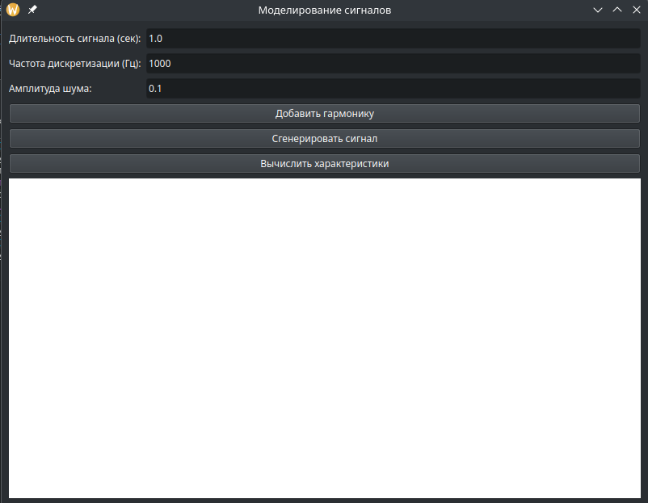
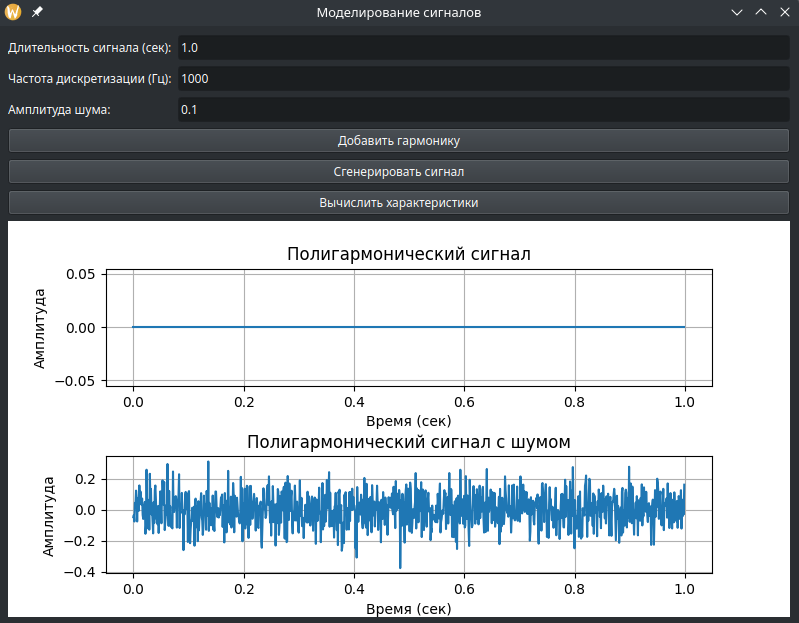
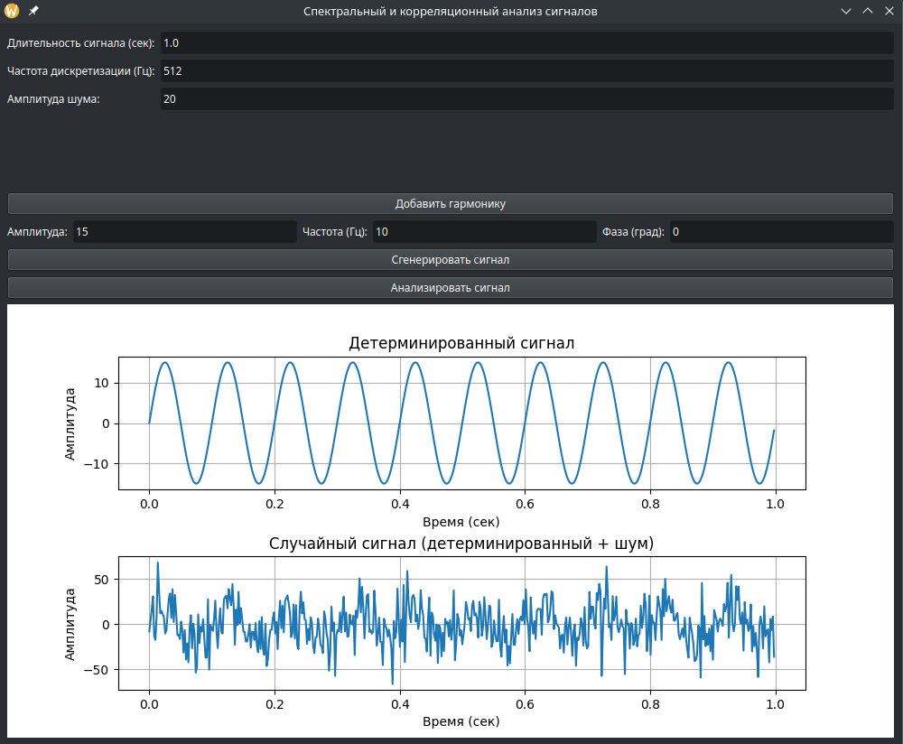
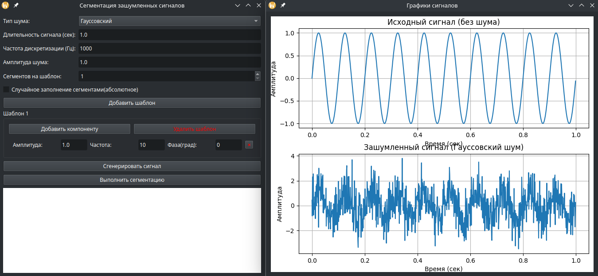
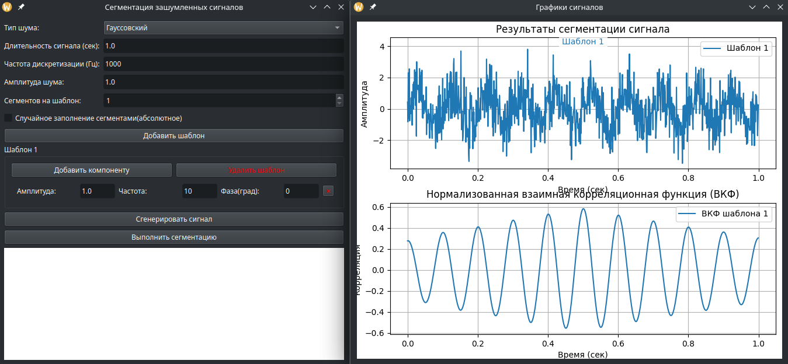

# Документация к лабораторным работам по моделированию и анализу сигналов

## Содержание
1. [Лабораторная работа 1: Моделирование сигналов](#лабораторная-работа-1-моделирование-сигналов)
   - [Теоретические основы](#теоретические-основы)
   - [Интерфейс программы](#интерфейс-программы)
   - [Пример работы](#пример-работы)
   - [Анализ характеристик](#анализ-характеристик)

2. [Лабораторная работа 2: Спектральный и корреляционный анализ](#лабораторная-работа-2-спектральный-и-корреляционный-анализ)
   - [Методы анализа](#методы-анализа)
   - [Графики и интерпретация](#графики-и-интерпретация)
   - [Сравнение методов](#сравнение-методов)

3. [Лабораторная работа 3: Сегментация зашумленных сигналов](#лабораторная-работа-3-сегментация-зашумленных-сигналов)
   - [Алгоритм сегментации](#алгоритм-сегментации)
   - [Настройка шаблонов](#настройка-шаблонов)
   - [Визуализация результатов](#визуализация-результатов)

4. [Общие требования и установка](#общие-требования-и-установка)

---

## Лабораторная работа 1: Моделирование сигналов

### Теоретические основы
Программа моделирует полигармонический сигнал вида:  
\[ s(t) = \sum_{i=1}^{n} A_i \sin(2\pi f_i t + \phi_i) + \xi(t) \]  
где:
- \( A_i \) — амплитуда гармоники,
- \( f_i \) — частота,
- \( \phi_i \) — фаза,
- \( \xi(t) \) — гауссовский шум.

### Интерфейс программы
  
*Рис. 1: Главное окно программы с параметрами сигнала и гармониками.*

### Пример работы
1. **Ввод параметров:**
   - Длительность: 1 сек,
   - Частота дискретизации: 1000 Гц,
   - Амплитуда шума: 0.1.

2. **Добавление гармоник:**
   - Гармоника 1: \( A=1.0 \), \( f=5 \) Гц, \( \phi=0 \) рад,
   - Гармоника 2: \( A=0.5 \), \( f=10 \) Гц, \( \phi=45 \) рад.

3. **Результат:**  
     
   *Рис. 2: Детерминированный и зашумленный сигналы.*

### Анализ характеристик
| Параметр               | Значение (пример) |
|------------------------|------------------|
| Энергия сигнала        | 0.75 Дж          |
| Средняя мощность       | 0.75 Вт          |
| Максимальная амплитуда | 1.2              |

---

## Лабораторная работа 2: Спектральный и корреляционный анализ

### Методы анализа
1. **АЧХ/ФЧХ:**  
   Рассчитываются через БПФ (FFT) с применением оконной функции.
2. **СПМ:**  
   - Периодограмма,
   - Метод Уэлча (среднее по сегментам).
3. **АКФ:**  
   \[ R(\tau) = \sum_{t} s(t) \cdot s(t+\tau). \]

### Графики и интерпретация
  
*Рис. 3: АЧХ, ФЧХ и СПМ сигнала.*  
- Пики на АЧХ соответствуют частотам гармоник (5 Гц и 10 Гц).
- Метод Уэлча снижает дисперсию СПМ по сравнению с периодограммой.

### Сравнение методов
| Метод          | Преимущества                  | Недостатки               |
|----------------|-------------------------------|--------------------------|
| Периодограмма  | Простота реализации           | Высокая дисперсия        |
| Уэлча          | Сглаживание шума              | Снижение разрешения      |

---

## Лабораторная работа 3: Сегментация зашумленных сигналов

### Алгоритм сегментации
1. **Корреляционный анализ:**  
   Для каждого шаблона вычисляется ВКФ с сигналом:  
   \[ \text{ВКФ}(t) = \sum_{\tau} s(\tau) \cdot \text{шаблон}(\tau + t). \]
2. **Классификация сегментов:**  
   Сегмент относится к шаблону с максимальной корреляцией.

### Настройка шаблонов
  
*Рис. 4: Добавление шаблона с компонентами.*  
- Шаблон может включать несколько синусоид (например, \( f_1=10 \) Гц, \( f_2=20 \) Гц).

### Визуализация результатов
  
*Рис. 5: Цветовая маркировка сегментов и график ВКФ.*  
- Красные линии — границы сегментов,
- Цвета соответствуют разным шаблонам.

---

## Общие требования и установка

### Системные требования
- ОС: Windows/Linux/macOS,
- Python 3.8+,
- 4 ГБ ОЗУ.

### Установка
```bash
pip install -r requirements.txt  # numpy matplotlib scipy PyQt5